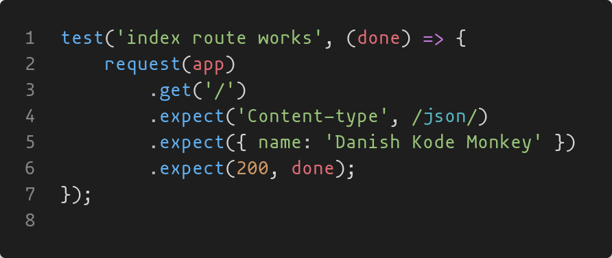
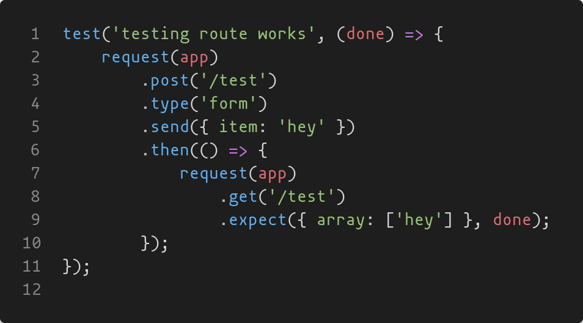

# Express unit testing

A simple project to outline various unit testing methods of express routes.

To facilitate testing the routes, I will use [SuperTest](https://github.com/ladjs/supertest), a module providing a high-level abstraction for testing HTTP, while still allowing access to the lower-level API provided by superagent. This project aims to provide hands-on experience with testing the routes of an Express app.

## Introduction

Unit testing is a critical practice in software development that ensures individual components of an application work as expected. In the context of an Express application, unit testing routes is essential to verify that the server handles requests and responses correctly.

The following is the documentation of the experience.

## Project structure

The experiment includes tow main files

-**app.js**: Starts and runs the express application -**index.js**: Contains the routes and sub-routes used for testing.

## Testing setup

We leverage Jest for creating test cases in a familiar describe/test block syntax. Tests are run by chaining methods of the request function provided by SuperTest.



Tests can furthermore be nested to several requests.



To break down what's happening here:

First, we import the module being tested, index.js.

```javascript
const index = require('./index');
```

Along with the installed module supertest, and express.

```javascript
const request = require('supertest');

const express = require('express');
```

We set up a new express app for testing, and use the index router from before.

It's important for testing purposes that we create a seperate express, so we are not touching our original app.js file. This is to avoid calling the app.listen command accidently starting the server, but also to isolate the testing enviroment and skip some optional configuration steps that aren't needed.

```javascript
const app = express();

app.use(express.urlencoded({ extended: false }));
app.use('/', index);
```

With the setup done we can get testing, the process is straightforward enough, resembling general jest testing alot.

#### test 1.

We create a test using the imported supertest function request, calling it on our new express app, and pass our route, making sure the route responses match the types and content we expect.

```javascript
test('index route works', (done) => {
    request(app)
        .get('/')
        .expect('Content-type', /json/)
        .expect({ name: 'Danish Kode Monkey' })
        .expect(200, done);
});
```

The main difference to note is the use of a `done` parameter. This is used in most testing libraries to signal the test is complete in asynchronous operations. Thanks to this, supertest allows us to pass it to the last .expect call, calling it for us to effectively end the test! Sweet!

This first test mainly handles the GET request of the index page, checking if it succesfully GETs the page.

#### test 2.

The next test attempts to create a POST request to the /test sub-route, and fetch it afterwards.

This is handled by using promises to chain together several CRUD operations, ending with the done callback once all operations are done.

This allows us to ensure that the POST request finished, before we call the GET request, checking if the item has been pushed into the array.

```javascript
test('testing route works', (done) => {
    request(app)
        .post('/test')
        .type('form')
        .send({ item: 'hey' })
        .then(() => {
            request(app)
                .get('/test')
                .expect({ array: ['hey'] }, done);
        });
});
```

If a real database was used, similar methods would be used against a test or mock database.

To that effect, we can use mongodb-memory-server to spin up a in-memory mongoDB server to connect o and use in a testing enviroment. Since its fresh, we wont have to worry about poluting our production databases.

To do this, there is some additional set up to be done.

First, we need to seperate mongo/mongoose setup by creating seperate configuration files for produciton, and testing. In this case just making one for the testing enviroment.

In a real world example however, seperating the configurations in different files is important to prevent accidently touching the actual production database.

So, in our config folder we have the mongoConfigTesting.js file

```javascript
const mongoose = require('mongoose');
const { MongoMemoryServer } = require('mongodb-memory-server');

async function initializeMongoServer() {
    const mongoServer = await MongoMemoryServer.create();
    const mongoUri = mongoServer.getUri();

    mongoose.connect(mongoUri);

    mongoose.connection.on('error', (e) => {
        if (e.message.code === 'ETIMEDOUT') {
            console.log(e);
            mongoose.connect(mongoUri);
        }
        console.log(e);
    });

    mongoose.connection.once('open', () => {
        console.log(`MongoDB successfully connected to ${mongoURI}`);
    });
}
module.exports = initializeMongoServer;
```

From this we now have a function initializeMongoServer that creates a mock database, generate a URI, and pass it to mongoose to connect to.

We can now call this function during testing to hook up the mock database!
